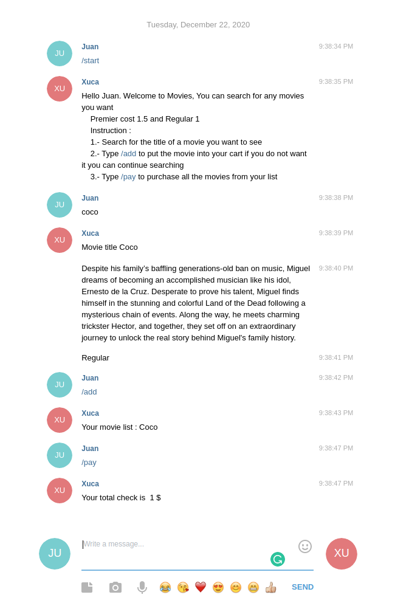

# Ruby-Capstone-Project

# Telegram Bot - Movie App

In this project, I created a bot that helps the users to buy movies online.



In this project, I make a Telegram bot the API given by the BotFather from telegram and the Api TMDB

# Description

With this bot:
You can search for your movies by tittle, add them to your shopping cart and buy them.

## Built With

- Ruby
- Ruby gem Telegram-bot
- Ruby gem Rspec
- Ruby gem bundle
- Ruby themoviedb-api

## Getting Started

## 📝 Setup the telegramBot

- Download Telegram or enter to https://web.telegram.org/#/login

- Sign in Telegram

- Open telegram.

- Search for: @xuxuruca_bot

- Click on start

- Follow instructions

> Take a copy of this project locally

- Go to github.
- Press the "Code" button and get the repo link.
- Clone it using git clone.

```
git clone "https://github.com/Wusinho/Ruby-Capstone-Project.git"
```

- On the terminal type

```
bundle install
```

- and run it with :

```
bundle exec ruby /bin/main.rb
```

## Test it

> If you want to test the unit code, type on terminal

```
rspec
```

## Author

<b>Heber Lazo</b>

- Github: [@Heber-Lazo](https://github.com/Wusinho)
- LinkedIn: [@Heber-Lazo](https://www.linkedin.com/in/heber-lazo-benza-523266133/)

## Acknowledgments

- [Microverse](https://www.microverse.org/)
- [The Odin Project](https://www.theodinproject.com)
- [Telegram](https://web.telegram.org/)
- [TMDB](https://www.themoviedb.org/)

## Show your support

<p> Give a 
  <g-emoji class="g-emoji" alias="star" fallback-src="https://github.githubassets.com/images/icons/emoji/unicode/2b50.png"></g-emoji>
  if you like this project!</p>

## License

This project is [MIT](LICENSE) licensed.
